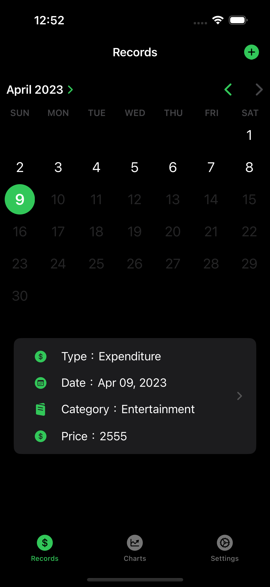

# Money with Swift Playgrounds App

## Description

Side Project - Billing App

App Name：Money

## Development Environment

- macOS Ventura 13.3
- Xcode 14.3
- Support iOS、iPadOS、macOS system
- Use Swift Playgrounds App + SwiftUI to develop
- Use CoreData Framework to save Data
- Use Swift Charts Framework to draw Charts
- Use Local Authentication Framework to unlock App

## Screenshots

### Record

### Charts

### Settings

